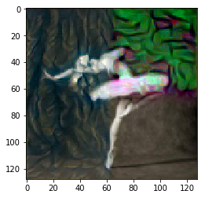
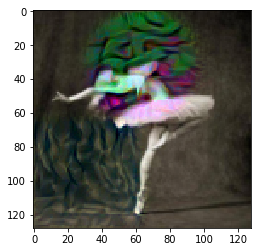

# Spatial Style Transfer
This is package for doing spatially controlled style transfer in PyTorch. This project is based off on the [style transfer tutorial of PyTorch](https://pytorch.org/tutorials/advanced/neural_style_tutorial.html) and a paper about [spatial control in style transfer](https://www.google.com/url?sa=t&rct=j&q=&esrc=s&source=web&cd=2&ved=2ahUKEwiWo6yjuvrlAhWymOAKHReJBxMQFjABegQIBhAH&url=http%3A%2F%2Fcs231n.stanford.edu%2Freports%2F2017%2Fpdfs%2F417.pdf&usg=AOvVaw0JY1XaUWpLBPtmGWR24BOs).

One can easy utilize the package as demonstrated in the [notebook](notebooks/demo.ipynb).

One example, when one applies a mask for the left side and upper right corner.

Another example, when one applies a mask for a circle in the middle of the upper half and the lower left corner.

